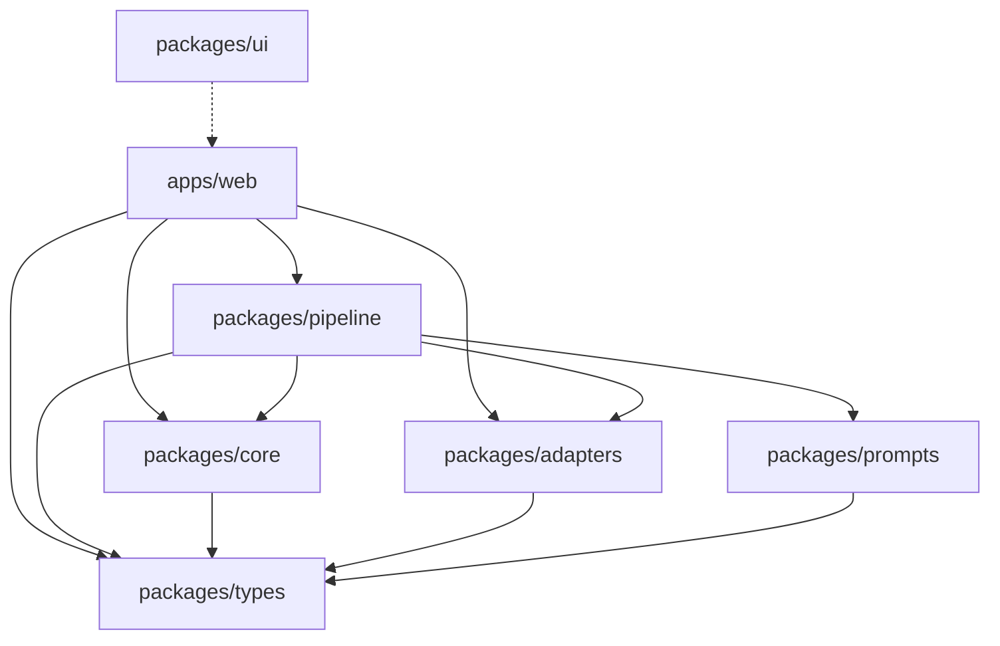

# Architecture

## System Overview

SRTora is a local-first AI subtitle translation application built as a modular monolith in a pnpm monorepo. The architecture prioritizes:

- **Local execution** — translation runs entirely in the browser for local providers
- **Shared pipeline core** — the same pipeline logic works for local and cloud modes
- **Clean package boundaries** — each package has a focused responsibility

## Package Dependency Graph



## Package Responsibilities

### `@srtora/types`
Pure TypeScript type definitions using Zod schemas. Zero runtime dependencies. Defines the full domain model: subtitle documents, provider configs, pipeline state, session memory, errors.

### `@srtora/core`
Subtitle file processing:
- **Parser** — SRT and VTT parsing with format auto-detection
- **Assembler** — Rebuilds SRT/VTT from translated content
- **Chunking** — Splits documents into overlapping translation chunks
- **Validation** — Validates parsed documents and translation output

### `@srtora/adapters`
LLM provider communication:
- **OllamaAdapter** — Ollama API (`/api/chat`, `/api/tags`)
- **OpenAICompatibleAdapter** — OpenAI-compatible APIs (covers MLX, OpenAI, Gemini, Anthropic)
- **JSON repair** — Fixes malformed LLM output
- **Retry** — Exponential backoff with jitter and abort support

### `@srtora/prompts`
Translation prompt construction:
- **Builders** — Analysis, translation, and review prompt builders
- **Strategies** — `DefaultStrategy` (system + user messages) and `GemmaStrategy` (single user message for TranslateGemma)
- **Schemas** — JSON schemas for structured output enforcement

### `@srtora/pipeline`
Pipeline orchestration:
- **Orchestrator** — Coordinates the full 5-phase pipeline
- **Progress Tracker** — Weighted progress calculation with ETA estimation

### `apps/web`
Next.js 15 frontend:
- Two-column workspace layout (config + execution)
- Zustand state management
- Provider connection and model discovery
- Live progress visualization

## Data Flow

```
User uploads .srt/.vtt
        │
        ▼
    ┌─────────┐
    │  Parse   │  Detect format, extract cues, validate
    └────┬────┘
         │
         ▼
    ┌─────────┐
    │ Analyze  │  Extract speakers, terms, tone (optional)
    └────┬────┘
         │
         ▼
    ┌───────────┐
    │ Translate  │  Chunked translation with context windows
    │ (chunked)  │  Session memory + terminology injection
    └────┬──────┘
         │
         ▼
    ┌─────────┐
    │ Review   │  Flag and fix issues (optional)
    └────┬────┘
         │
         ▼
    ┌─────────┐
    │ Assemble │  Merge translations, validate, build output
    └────┬────┘
         │
         ▼
    Download translated file
```

## Execution Model

### Local Mode (Primary)

```
Browser ──► Pipeline Orchestrator ──► Ollama/MLX (localhost)
                    │
                    ├── Progress events → Zustand store → UI
                    └── Result → Download
```

The pipeline orchestrator runs in the browser's main thread. This is intentional — the pipeline is I/O-bound (waiting for LLM HTTP responses), not CPU-bound, so it doesn't block the UI.

### Cloud Mode

```
Browser ──► Pipeline Orchestrator ──► Cloud API (OpenAI/Gemini/Anthropic)
```

Cloud mode uses the same orchestrator and pipeline logic. The only difference is the provider adapter and base URL. API keys are session-scoped and never persisted.

## Key Design Decisions

1. **No backend for local mode** — Direct browser → localhost communication
2. **Sequential chunk translation** — Maintains context via `previousTranslations` map
3. **Zod for runtime validation** — All LLM output is validated against schemas
4. **Auto-detect prompt strategy** — Model name triggers GemmaStrategy for Gemma models
5. **Structured output enforcement** — JSON schemas passed to adapters for native enforcement
